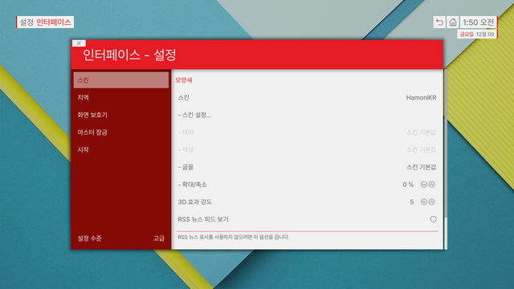

## KODI for HamoniKR

KODI Media Player



### how to build debian package from source

하모니카 6.0 에서 빌드 시 
의존성이 맞지 않는 패키지 때문에 빌드 환경이 준비되지 않는 경우가 발생해서, 
오류가 나는 libcdio-2.1.0 패키지를 새로 빌드한 후
repo.hamonikr.org taebaek 저장소의 dev 컴포넌트에서 제공하고 있으니 빌드 시 참고

```
sudo apt install devscripts equivs
git clone https://github.com/hamonikr/kodi.git
cd kodi

# install dependencies (source repos must be enabled and you need to confirm the installation)
sudo mk-build-deps -ir

# build
dpkg-buildpackage

# install
sudo dpkg -i ../*.deb
```

### 한글 스킨만 사용하려면
```
git clone https://github.com/hamonikr/kodi.git

cp kodi/addons/skin.hamonikr ~/.kodi/addons/
```
